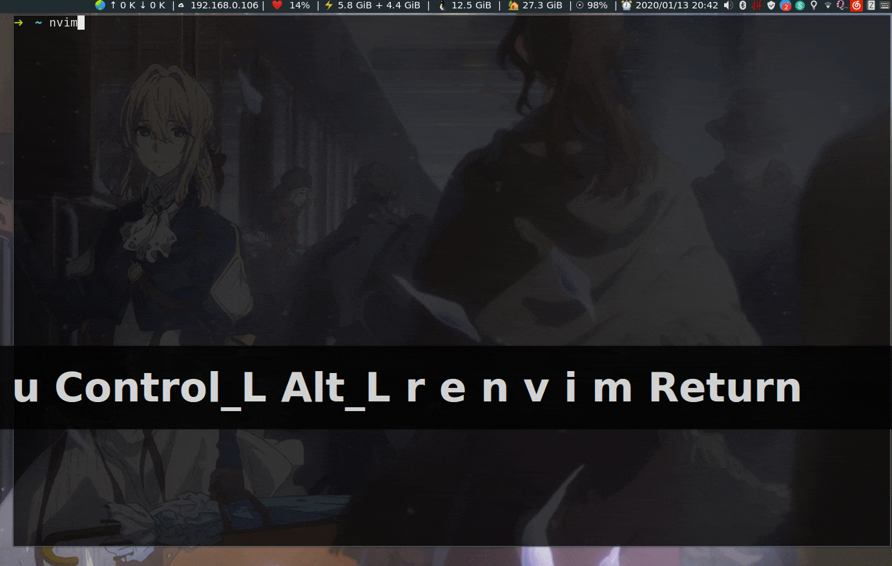

# vim-smartim
[WIP] Smart switch input method (zh\<-\>en) automatically when (Neo)VIM mode change(INSERT\<-\>NORMAL)



Tested on my Linux(Manjaro-i3), I'm using the default PinYin IM and English(en\_US) IM from `fcitx`:

**PS**: My shortcut for change IM is `Control+,`, it not appears on the `screenkey` echo bar

## Installation
### Prerequirement
- Your environment are using `fcitx` to manage input method
- Command `fcitx-remote` is executable

Then just install it with your favorite package manager like:

```vimscript
" vim-plug
Plug 'StrayDragon/vim-smartim'
```

It will work automatically, and enjoy it! :smile:

## TODO
- [ ] Could enable or disable this plugin
- [ ] Configurable: for specific filetypes


## Inspired by
- [fcitx.vim](https://github.com/vim-scripts/fcitx.vim)


## Reference
- [vim 中文输入解决方案](https://zhuanlan.zhihu.com/p/23939198)
- [VSCodeVim](https://github.com/VSCodeVim/Vim/blob/3e69d278f21871f05ecb562e6117748b0538cd70/src/actions/plugins/imswitcher.ts)

## License
MIT
